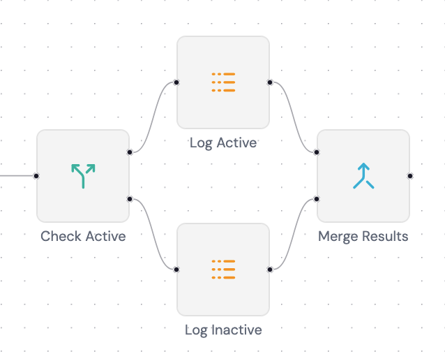

## Introduction

I've been using n8n for quite some time now and couldn't help wondering how it works under the hood, so I decided to build a minimal working version of the engine myself.
This post covers how the engine handles execution order, the pluggable node system, expression evaluation, and the diamond merge pattern.

### 1. What is a Workflow Engine?

Basically a workflow engine is just a graph where it has 2 or more nodes that have individual functions like “fetch this URL” or “check this condition”. These connections between nodes is what define the data flow.

At first I was working with a sample data that have a correct topological order (`node 1 -> node 2 -> node 3`), then come the issue when I try to randomize the node order (`node 3 -> node 1 -> node 2`) and this is the tricky part: **the execution order**. You cannot run a node before it’s dependencies have finished and passed their data forward, where in the original case `node 3` depends on `node 2` but at the second case the `node 2` is executed last and this doesn’t meet `node 3` requirements. That is a simple case, but what happens when you have branches, merges? Figuring out the correct order becomes important.

That’s where Directed Acyclic Graph (DAG) concept comes in. Directed because connections always have a direction which is flows in one way and Acyclic because there are no loop because a node cannot eventually depend on itself (ex: `node 1 -> node 2 -> node 3 -> node 1`).

### 2. Execution Order: Kahn's Algorithm Introduction

Once I knew what's the graph structure I decided to use, I needed to figure out how could I produce the correct order and this is where Kahn's algorithm comes in. [I learn it from here.](https://www.youtube.com/watch?v=cIBFEhD77b4)

Basically every node has an **in-degree** which is the number of incoming connection it has, well let's call it dependencies. A node with 0 in-degree has no dependencies so it is safe to execute. Once a node is finished, we can add it into the correct topological order or queue and remove the dependency of other nodes to this node and the process is looped until all of the node has no dependency and get executed totally. Here's how I implement it:

```ts
const queue: NodeType[] = [];
const dependencies: Map<string, string[]> = new Map();

// Set a map of dependencies for each node
for (const node of nodes) {
  dependencies.set(
    node.description.name,
    node.description.input.map((i) => i.fromNode),
  );
}

// Kahn's algorithm process loop
while (true) {
  // Stop the loop when the queue is completed
  if (queue.length >= nodes.length) break;

  // Loop over dependencies map
  for (const [key, degrees] of dependencies) {
    // Skip dependency loop process when node still have dependency
    if (degrees.length) {
      continue;
    }

    // Node with no dependencies get added to queue
    queue.push(nodeMap.get(key)!);

    // Removing this node from dependency map
    dependencies.delete(key);
    // Removing dependency of other nodes to current node
    dependencies.forEach((_degrees, _key, map) => {
      map.set(
        _key,
        _degrees.filter((deg) => deg != key),
      );
    });
  }
}

return { queue };
```

The end result is a correct topological order/queue of nodes that safe to execute properly without worry of missing dependency.

### 3. The Node System

All node inside this engine must extend an interface called `BaseNodeType`. Basically this is how it's structured:

```ts
export interface BaseNodeType {
  description: BaseNodeTypeDescription;
  execute: (ctx: NodeContext) => Promise<NodeExecutionData[][]>;
}

export interface BaseNodeInput {
  fromNode: string;
  fromOutputIndex: number;
  toInputIndex: number;
}

export interface BaseNodeOutput {
  toNode: string;
  toOutputIndex: number;
}

export interface BaseNodeTypeDescription {
  name: string;
  displayName: string;
  input: BaseNodeInput[];
  output: BaseNodeOutput[];
  parameters: BaseNodeParameters;
  position: { x: number; y: number };
}

export type NodeType =
  | TriggerNode
  | HttpRequestNode
  | IfNode
  | LogNode
  | MergeNode;
```

The `execute` method is the heart of it. It receives input data from upstream nodes and returns output data for downstream nodes. That's the only contract the engine needed the most. The `description` is combination for UI stuff and custom parameters a node needed.

Up there you can see `NodeType` is a union type of various type of node, I'll give you some example of how a specific node type interface look like:

```ts
// This is how a basic node type look like
export interface TriggerNode extends BaseNodeType {
  description: TriggerNodeDescription;
}

export interface TriggerNodeDescription extends BaseNodeTypeDescription {
  type: "trigger";
}

// This is how an advanced node with custom parameters look like
export interface HttpRequestNode extends BaseNodeType {
  description: HttpRequestNodeDescription;
}

export interface HttpRequestNodeDescription extends BaseNodeTypeDescription {
  type: "httpRequest";
  parameters: HttpRequestNodeParameters;
}

export interface HttpRequestNodeParameters extends BaseNodeParameters {
  url: string;
  method: "GET" | "POST" | "PUT" | "DELETE" | "PATCH";
}
```

Registering a new node type is pretty straightforward, you just need to register it inside the node registry:

```ts
export const nodeRegistry: Record<NodeTypes, WorkflowNodeToNodeType> = {
  trigger: getTriggerNode,
  httpRequest: getHttpRequestNode,
  if: getIfNode,
  log: getLogNode,
  merge: getMergeNode,
};
```

Each node type handles its own logic internally. Here's a code example of a node that needed input from upstream like `log` look like:

```ts
const execute: NodeType["execute"] = (ctx) => {
  const items = ctx.getInputData();
  const message = ctx.getNodeParameter("message") as string;

  for (const item of items) {
    for (const innerItem of item) {
      const result = expressionEngine(innerItem.json, message);
      log(chalk.italic.green("[Log Node]", result));
    }
  }

  return Promise.resolve(items);
};

export const getNode: WorkflowNodeToNodeType = (workflow, node) => {
  const input = getNodeInput(workflow, node);
  const output = getNodeOutput(workflow, node);

  return {
    description: {
      name: node.id,
      displayName: node.name,
      input,
      output,
      parameters: node.parameters as unknown as LogNodeParameters,
      type: "log",
      position: node.position,
    },
    execute,
  };
};
```

### 4. The Data Pipeline

Every node inside the engine receives and returns data as `NodeExecutionData[][]`, it may look strange, but it has a reason why it's a 2D array.

```ts
interface NodeExecutionData {
  json: object;
}
```

The first dimension array is for how many connections a node have, like for example in this project an `if` node receive 1 data input from `httpRequest` node and output 2 data for its true and false branches. So basically when a node receive a single input (which is most of the time it is), its data is always a single array data inside the connection array. As for the second dimension array (or we can call it inner array) is representing an items that get carried from previous node or get sent to next node, even though previous node or current node receive/sent single item, it must be inside an array no matter what.

Basically here's how the data look like:

```json
// Single connection data
[
  [
    {
      "json": {
        "id": 1,
        "name": "Leanne Graham",
        "username": "Bret",
        "email": "Sincere@april.biz"
      }
    }
  ]
]

// Multiple connection data
[
  [
    {
      "json": {
        "id": 1,
        "name": "Leanne Graham",
        "username": "Bret",
        "email": "Sincere@april.biz"
      }
    }
  ],
  [
    {
      "json": {
        "id": 4,
        "name": "Patricia Lebsack",
        "username": "Karianne",
        "email": "Julianne.OConner@kory.org",
      }
    },
  ]
]
```

### 5. Sandboxed Expression Evaluation

One of the core features that I want to explore and support is the dynamic expression inside node parameters, for example a URL for `httpRequest` node:

```
https://jsonplaceholder.typicode.com/users/{{ $json.id }}
```

Where the `$json.id` get evaluated at runtime based on the input of the previous node. My first approach was `eval()`, which works but is considered dangerous because it has access to the entire runtime. I then tried the Function Constructor approach, which is safer since it only executes in the global scope with no access to local variables. But I wanted something more isolated, so I ended up using Node's `vm.runInNewContext`. Here's some references you can read about an approach to evaluate a JavaScript code:

- [eval](https://developer.mozilla.org/en-US/docs/Web/JavaScript/Reference/Global_Objects/eval)
- [Function Constructor](https://developer.mozilla.org/en-US/docs/Web/JavaScript/Reference/Global_Objects/Function/Function)
- [vm.runInNewContext](https://nodejs.org/api/vm.html#vmruninnewcontextcode-contextobject-options)

So here's how the expression engine look like in this project:

```ts
export function expressionEngine(json: object, expression?: string): string {
  if (!expression) return "";
  const output = expression.match(/\{\{(.+?)\}\}/g) ?? [];

  let _finalExpression: string = expression;
  for (const expItem of output) {
    const replacedExp = expItem.replace("{{", "").replace("}}", "").trim();
    const result = vm.runInNewContext(replacedExp, {
      $json: json,
      $now: new Date(),
    });
    _finalExpression = _finalExpression.replaceAll(
      expItem,
      !result ? "" : result,
    );
  }

  return _finalExpression;
}
```

Basically it need the json item from node to use as a context and the raw expression, then the process goes as follow:

1. Search all of the expressions inside the raw string
2. For each expression clear the braces, get evaluated with `vm.runInNewContext` and replace the expression inside the raw string.
3. Lastly return the final expression that have been replaced by the actual data that get evaluated.

### 6. The Diamond Merge Pattern

Up until this point we only handle a regular workflow without a merging mechanism, but this is where things get tricky. What happens when an `if` node splits the flow into two branches (in this case a 2 `log` node) that get merged into a `merge` node:



The `merge` node has 2 input slots, how does it know which data belongs to which slot? This is where the `toInputIndex` property from `BaseNodeInput` the same interface we've seen at [The Node System](#3-the-node-system) come in handy. It's a number that tells the engine to which slot of it will end up at the destination node.

### 7. Wiring It All Together

The engine itself is mostly just pure TypeScript logic and doesn't care how it gets triggered. To make it accessible to the frontend demo I wrapped it in an Express server. There are 2 core endpoints, the others is just for frontend need.

1. Execute Workflow

```
[POST] /workflows/execute
{
  "jobId": "string",
  "workflowId": "string"
}
```

2. Track Workflow Job

This is for a Server-Sent Event (SSE)

```
[GET] /workflows/track/:jobId
```

The frontend send an execute request with random generated `jobId` and a `workflowId` to know which workflow to execute. You might be wondering, why the `jobId` is generated on the frontend? That's because a race condition will happen when it wait for the backend to sent the `jobId` because I use SSE for the frontend to listen to. So with this solution the frontend can listen to the generated `jobId` first then request the execute after, that way the frontend won't miss any events.

Basically the flows look like this:

1. Frontend fetch workflows data
2. User click the Execute button
3. `jobId` get generated and frontend listening to the Track Workflow endpoint (which is an SSE endpoint)
4. Send `POST` request to execute endpoint with `jobId` and `workflowId` included
5. The engine executes nodes one by one and sent a callback for each event to the SSE
6. The frontend receives the event and updates the React Flow node state accordingly

## What I Learned

At first I thought a workflow engine isn't really complicated at its core because to me it looks like just an async function (whole workflow) that have an await request (node) waiting for each others and it turned out to be really wrong. Here I learned that a workflow can't just be completed by a simple ordering logic so each nodes need to be cleared of their dependencies and that's where I learned the Kahn's topological sort which is a really good match for this kind of logic.

Also I learned about how a JavaScript string code get evaluated, how high the security risk is for this kind of feature and I need to concern about the context I give to the code execution.

On side notes I learned how to use `react-flow` on the frontend side to make a workflow UI similar to n8n, how to make the node on the UI side reusable, making the properties modal for each different type of node, listening to SSE and much more.

Building this gave me a much deeper appreciation for tools like n8n that make all of this complexity invisible to the user, but also that's what makes it interesting for me in the first place.

## What's Next?

I think for the continuation of this project I will try to tinker around how's the expression input in n8n works, like their autosuggestion, validator, even how the evaluation works on the frontend side.

If you have any suggestions or questions, feel free to reach out to me on [LinkedIn](https://www.linkedin.com/in/ilham-adiputra) or open a discussion on the [GitHub repo](https://github.com/ilham25/workflow-ts).

The frontend demo used in this post can be found [here](https://github.com/ilham25/workflow-ts-playground).
